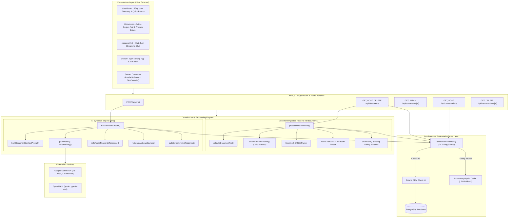
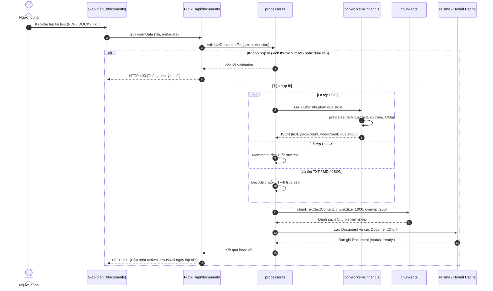
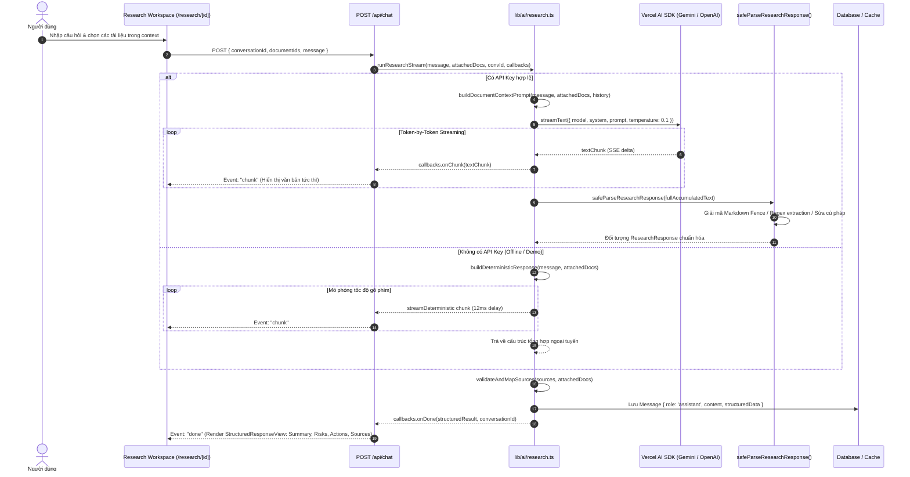
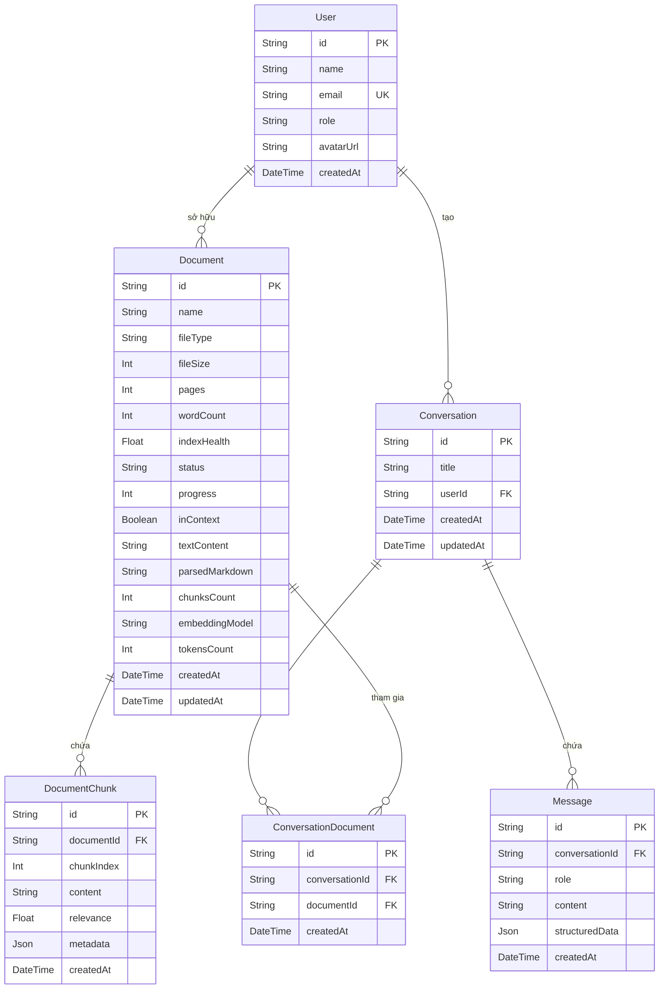

# Tài liệu Kiến trúc Kỹ thuật (Technical Architecture Document)
## ResearchAI Studio Core — AI Research Workspace

> **Tác giả:** Đội ngũ Kỹ thuật & Nghiên cứu AI  
> **Phiên bản:** 1.0.0 (Release Candidate)  
> **Cập nhật lần cuối:** 2026-09-29  
> **Hệ sinh thái:** Next.js 16 (App Router) • React 19 • TypeScript • Tailwind CSS v4 • Prisma ORM • Vercel AI SDK • Jest

---

## Mục lục

1. [Tổng quan hệ thống & Triết lý kiến trúc](#1-tổng-quan-hệ-thống--triết-lý-kiến-trúc)
2. [Sơ đồ kiến trúc tổng thể (System Architecture)](#2-sơ-đồ-kiến-trúc-tổng-thể-system-architecture)
3. [Kiến trúc phân tầng chi tiết (Layered Architecture)](#3-kiến-trúc-phân-tầng-chi-tiết-layered-architecture)
   - [3.1 Presentation Layer (Giao diện người dùng)](#31-presentation-layer-giao-diện-người-dùng)
   - [3.2 API Route Handlers (Tầng điều phối HTTP & Streaming)](#32-api-route-handlers-tầng-điều-phối-http--streaming)
   - [3.3 AI Synthesis Engine (Tầng suy luận & Trí tuệ nhân tạo)](#33-ai-synthesis-engine-tầng-suy-luận--trí-tuệ-nhân-tạo)
   - [3.4 Document Ingestion & Chunking Pipeline](#34-document-ingestion--chunking-pipeline)
   - [3.5 Persistence & Dual-Mode Hybrid Cache Layer](#35-persistence--dual-mode-hybrid-cache-layer)
4. [Luồng dữ liệu chi tiết (Detailed Data Flows)](#4-luồng-dữ-liệu-chi-tiết-detailed-data-flows)
   - [4.1 Luồng nạp và xử lý tài liệu (Document Ingestion Flow)](#41-luồng-nạp-và-xử-lý-tài-liệu-document-ingestion-flow)
   - [4.2 Luồng tổng hợp đa tài liệu & Streaming phản hồi](#42-luồng-tổng-hợp-đa-tài-liệu--streaming-phản-hồi)
   - [4.3 Cơ chế chịu lỗi & Tự phục hồi (Resilience & Fallback Strategy)](#43-cơ-chế-chịu-lỗi--tự-phục-hồi-resilience--fallback-strategy)
5. [Thiết kế Cơ sở dữ liệu & Mô hình thực thể (Database Schema & ERD)](#5-thiết-kế-cơ-sở-dữ-liệu--mô-hình-thực-thể-database-schema--erd)
6. [Giao thức Streaming & Xử lý phản hồi có cấu trúc](#6-giao-thức-streaming--xử-lý-phản-hồi-có-cấu-trúc)
7. [Chiến lược kiểm thử & Đảm bảo chất lượng (Testing & QA)](#7-chiến-lược-kiểm-thử--đảm-bảo-chất-lượng-testing--qa)
8. [Bảo mật, Hiệu năng & Khả năng mở rộng (Security, Performance & Scalability)](#8-bảo-mật-hiệu-năng--khả-năng-mở-rộng-security-performance--scalability)

---

## 1. Tổng quan hệ thống & Triết lý kiến trúc

**ResearchAI Studio Core** là nền tảng nghiên cứu và tổng hợp tri thức đa tài liệu (Multi-Document Synthesis Workspace) dành cho các nhà nghiên cứu, kỹ sư phần mềm và chuyên viên phân tích. Hệ thống giải quyết bài toán cốt lõi: **chuyển hóa khối lượng tài liệu khổng lồ (PDF, DOCX, TXT) thành các báo cáo phân tích có cấu trúc, chuẩn hóa cao, được trích dẫn nguồn xác thực và có thể hành động ngay lập tức.**

### Bốn nguyên tắc kiến trúc cốt lõi:

```
┌────────────────────────────────────────────────────────────────────────┐
│                        TRIẾT LÝ KIẾN TRÚC                              │
├──────────────────┬──────────────────┬─────────────────┬────────────────┤
│ 1. Resilience    │ 2. Streaming     │ 3. Strict Schema│ 4. Clear       │
│    First         │    First         │    Validation   │    Separation  │
│ Không sập dù DB  │ Phản hồi token   │ JSON có kiểu dữ │ Phân tách bạch │
│ hoặc API Key lỗi │ độ trễ cực thấp  │ liệu rõ ràng    │ giữa UI, API   │
│ (Dual-mode)      │ qua SSE/Stream   │ (Zod contract)  │ và Engine Core │
└──────────────────┴──────────────────┴─────────────────┴────────────────┘
```

1. **Khả năng chịu lỗi tối đa (Resilience First):** Hệ thống không bao giờ gặp crash màn hình trắng hoặc treo vô hạn. Nếu cơ sở dữ liệu PostgreSQL chưa khởi chạy, hệ thống kích hoạt tự động bộ đệm trong bộ nhớ (`In-Memory Hybrid Cache`). Nếu không có API Key của nhà cung cấp LLM, hệ thống sử dụng thuật toán suy luận ngoại tuyến giả lập (`Deterministic Engine`) để môi trường demo và phát triển luôn thông suốt.
2. **Ưu tiên thời gian thực (Streaming First):** Khai thác chuẩn `ReadableStream` và Server-Sent Events (SSE) để truyền tải từng token phản hồi trực tiếp tới người dùng, giải quyết hoàn toàn cảm giác chờ đợi khi LLM phân tích tài liệu dài.
3. **Cấu trúc dữ liệu nghiêm ngặt (Strict Schema Validation):** Không xuất bản văn bản dạng thô (unstructured raw text). Mọi kết quả tổng hợp bắt buộc phải tuân thủ hợp đồng kiểu dữ liệu `ResearchResponse` định nghĩa bởi [Zod](file:///e:/CV_Project/AI_RESEARCH_WORKSPACE/ai-research-workspace/types/research.ts) bao gồm: Tóm tắt điều hành, Điểm cốt lõi, Ma trận rủi ro, Lộ trình hành động, và Căn cứ trích dẫn.
4. **Phân tách trách nhiệm rõ ràng (Separation of Concerns):** Tách biệt rành mạch giữa các tầng Presentation (React Server & Client Components), API Handlers (Next.js Routes), Business Domain ([lib/ai/research.ts](file:///e:/CV_Project/AI_RESEARCH_WORKSPACE/ai-research-workspace/lib/ai/research.ts)), Document Extractors ([lib/documents/parser.ts](file:///e:/CV_Project/AI_RESEARCH_WORKSPACE/ai-research-workspace/lib/documents/parser.ts)), và Persistence ([lib/prisma.ts](file:///e:/CV_Project/AI_RESEARCH_WORKSPACE/ai-research-workspace/lib/prisma.ts)).

---

## 2. Sơ đồ kiến trúc tổng thể (System Architecture)



---

## 3. Kiến trúc phân tầng chi tiết (Layered Architecture)

### 3.1 Presentation Layer (Giao diện người dùng)

Xây dựng trên nền tảng **Next.js 16 App Router**, **React 19**, **Tailwind CSS v4** và **Lucide React Icons**, mang phong cách thiết kế hiện đại, tinh gọn với tông màu sáng Cyber-Research thanh lịch, tối ưu trải nghiệm tương tác học thuật.

- [app/layout.tsx](file:///e:/CV_Project/AI_RESEARCH_WORKSPACE/ai-research-workspace/app/layout.tsx): Thiết lập khung vỏ toàn cục (Root Shell), tích hợp typography tiêu chuẩn (Geist Sans, Geist Mono, Material Symbols) và bộ thẻ meta chuẩn SEO.
- [components/layout/AppShell.tsx](file:///e:/CV_Project/AI_RESEARCH_WORKSPACE/ai-research-workspace/components/layout/AppShell.tsx): Điều phối bố cục responsive, kết hợp giữa `Sidebar` cố định (độ rộng 72w) và `MobileDrawer` dạng trượt trên thiết bị di động.
- [components/documents/ActiveCorpusRail.tsx](file:///e:/CV_Project/AI_RESEARCH_WORKSPACE/ai-research-workspace/components/documents/ActiveCorpusRail.tsx): Hiển thị trạng thái phân loại 4 giai đoạn của toàn bộ kho tài liệu (`ready`, `processing`, `uploading`, `failed`), cùng thước đo dung lượng lưu trữ (Storage Meter).
- [components/documents/DocumentPreviewDrawer.tsx](file:///e:/CV_Project/AI_RESEARCH_WORKSPACE/ai-research-workspace/components/documents/DocumentPreviewDrawer.tsx): Ngăn trượt bên phải hiển thị nội dung tài liệu với 4 chế độ tab: Markdown trích xuất, Văn bản thô (Raw text), Bảng biểu dữ liệu, và Phân đoạn Vector Chunks kèm nút xuất file Markdown.
- [components/research/StructuredResponseView.tsx](file:///e:/CV_Project/AI_RESEARCH_WORKSPACE/ai-research-workspace/components/research/StructuredResponseView.tsx): Thành phần giao diện điều phối chính, kết hợp 5 thẻ nghiệp vụ độc lập:
  - `<SummaryCard />`: Trình bày bản tổng hợp điều hành hoặc toàn bộ lời giải chi tiết kèm mã nguồn Markdown highlight hoàn chỉnh.
  - `<KeyPointsCard />`: Liệt kê các phát hiện thực nghiệm và luận điểm quan trọng.
  - `<RisksCard />`: Phân cấp rủi ro theo màu sắc ngữ nghĩa (`high` đỏ, `medium` vàng, `low` xanh dương).
  - `<ActionsCard />`: Lộ trình từng bước thực hiện giải pháp kỹ thuật.
  - `<SourcesCard />`: Thẻ trích dẫn căn cứ gốc hiển thị trang và trích đoạn.

### 3.2 API Route Handlers (Tầng điều phối HTTP & Streaming)

Các điểm cuối API được tổ chức theo chuẩn RESTful của Next.js Route Handlers:

| Endpoint | Method | Trách nhiệm | Chế độ truyền dữ liệu |
| :--- | :--- | :--- | :--- |
| `/api/chat` | `POST` | Tiếp nhận câu hỏi, điều phối phân tích tài liệu và truyền trực tiếp kết quả. | `ReadableStream` (SSE Events: `chunk`, `done`, `error`) |
| `/api/documents` | `GET` | Lấy danh sách toàn bộ tài liệu trong corpus kèm trạng thái chỉ mục. | JSON |
| `/api/documents` | `POST` | Tải lên tệp đa phần (multipart/form-data), chạy bóc tách và phân đoạn. | JSON |
| `/api/documents/[id]` | `GET` | Lấy chi tiết tài liệu, nội dung văn bản gốc và các phân đoạn (chunks). | JSON |
| `/api/documents/[id]` | `PATCH` | Bật/tắt trạng thái tham gia ngữ cảnh (`inContext: boolean`) của tài liệu. | JSON |
| `/api/documents/[id]` | `DELETE` | Xóa tài liệu khỏi cơ sở dữ liệu và bộ nhớ đệm. | JSON |
| `/api/conversations` | `GET` | Lấy danh sách lịch sử các phiên nghiên cứu. | JSON |
| `/api/conversations` | `POST` | Khởi tạo phiên nghiên cứu mới. | JSON |
| `/api/conversations/[id]`| `GET` | Tải toàn bộ chuỗi tin nhắn và tài liệu liên kết của một phiên. | JSON |
| `/api/conversations/[id]`| `DELETE` | Xóa phiên nghiên cứu và toàn bộ dữ liệu tin nhắn liên quan. | JSON |

### 3.3 AI Synthesis Engine (Tầng suy luận & Trí tuệ nhân tạo)

Tập trung tại thư mục [lib/ai/](file:///e:/CV_Project/AI_RESEARCH_WORKSPACE/ai-research-workspace/lib/ai/):

- **Dynamic Provider Loader ([lib/ai/client.ts](file:///e:/CV_Project/AI_RESEARCH_WORKSPACE/ai-research-workspace/lib/ai/client.ts)):**
  - Tự động nhận diện nhà cung cấp mô hình dựa trên định dạng tiền tố khóa API (`AQ.` hoặc `AIza` -> Google Gemini; `sk-...` -> OpenAI).
  - Đọc động khóa môi trường trực tiếp từ tệp đĩa `.env` / `.env.local` qua `getDiskEnvKey()` để tránh hiện tượng trễ cập nhật biến môi trường trên tiến trình Node.js đang chạy.
  - Cấu hình mô hình tối ưu: Mặc định `gemini-3.1-flash-lite` hoặc `gpt-4o-mini`, nâng cao với `gemini-3.8-flash` hoặc `gpt-4o`.
- **System Prompt Engineering ([lib/ai/prompt.ts](file:///e:/CV_Project/AI_RESEARCH_WORKSPACE/ai-research-workspace/lib/ai/prompt.ts)):**
  - `DAY2_SYSTEM_PROMPT`: Thiết lập vai trò chuyên gia nghiên cứu cao cấp, bắt buộc trả lời **100% bằng tiếng Việt**, bao quát xuyên suốt từ trang đầu đến trang cuối tài liệu, chủ động giải bài toán kèm khối mã nguồn Markdown hoàn chỉnh nếu có yêu cầu code, và định dạng JSON nghiêm ngặt theo schema.
  - `buildDocumentContextPrompt()`: Định dạng phân vùng tài liệu rõ ràng với số thứ tự, ID tài liệu, tên file và nội dung text, kết hợp lịch sử 6 lượt trao đổi gần nhất để giữ mạch đàm thoại liên tục.
- **Workflow Controller ([lib/ai/research.ts](file:///e:/CV_Project/AI_RESEARCH_WORKSPACE/ai-research-workspace/lib/ai/research.ts)):**
  - Hàm `runResearchStream()` là đầu não điều phối: nhận câu hỏi, gắn tài liệu, nạp lịch sử, gọi LLM qua Vercel AI SDK `streamText`, phân giải JSON an toàn, xác thực nguồn trích dẫn, và lưu trữ dữ liệu vào database/cache.

### 3.4 Document Ingestion & Chunking Pipeline

Tập trung tại thư mục [lib/documents/](file:///e:/CV_Project/AI_RESEARCH_WORKSPACE/ai-research-workspace/lib/documents/):

- **Kiểm định tệp ([lib/documents/processor.ts](file:///e:/CV_Project/AI_RESEARCH_WORKSPACE/ai-research-workspace/lib/documents/processor.ts)):**
  - Giới hạn dung lượng tối đa 25MB (`MAX_FILE_SIZE_BYTES`).
  - Hỗ trợ các định dạng `.pdf`, `.docx`, `.txt`, `.md`, `.json`.
- **Worker Isolation cho PDF ([lib/documents/parser.ts](file:///e:/CV_Project/AI_RESEARCH_WORKSPACE/ai-research-workspace/lib/documents/parser.ts)):**
  - Việc phân tích tệp PDF nhị phân thường gây xung đột module khi chạy trong môi trường bundle của Next.js/Turbopack.
  - `extractPdfWithWorker()` khởi tạo một tiến trình Node.js con độc lập ([lib/documents/pdf-worker-runner.cjs](file:///e:/CV_Project/AI_RESEARCH_WORKSPACE/ai-research-workspace/lib/documents/pdf-worker-runner.cjs)) thông qua IPC pipes (`child_process.spawn`).
  - Tự động ngắt (timeout) sau 15 giây nếu gặp tệp PDF hỏng hoặc lặp vô hạn.
  - Hỗ trợ giải mã bảng mã ký tự `/ToUnicode` CMap, chuyển đổi chuỗi nhị phân UTF-16BE với tiền tố BOM (`0xFE 0xFF`).
- **Phân đoạn văn bản thích ứng ([lib/documents/chunker.ts](file:///e:/CV_Project/AI_RESEARCH_WORKSPACE/ai-research-workspace/lib/documents/chunker.ts)):**
  - Sử dụng thuật toán cửa sổ trượt (Sliding Window Chunking) với kích thước mặc định 1000 ký tự và độ gối đầu (overlap) 200 ký tự.
  - Cắt phân đoạn thông minh dựa trên ranh giới tự nhiên của câu (dấu chấm `.`, xuống dòng `\n\n`) nhằm ngăn chặn việc cắt đứt ngữ nghĩa giữa chừng.

### 3.5 Persistence & Dual-Mode Hybrid Cache Layer

Được thiết kế để giải quyết bài toán môi trường cục bộ chưa cài đặt cơ sở dữ liệu:

- **Pre-flight TCP Socket Healthcheck ([lib/prisma.ts](file:///e:/CV_Project/AI_RESEARCH_WORKSPACE/ai-research-workspace/lib/prisma.ts)):**
  - Trước khi gọi bất kỳ truy vấn Prisma nào, hàm `isDatabaseAvailable()` mở một kết nối socket TCP mức thấp tới máy chủ PostgreSQL (cổng 5432) với giới hạn thời gian 300ms.
  - Kết quả được lưu tạm trong 15 giây.
  - **Lợi ích kiến trúc:** Ngăn chặn triệt để tình trạng Prisma Native Engine in hàng loạt thông báo lỗi kết nối ra `stderr` làm chậm vòng lặp sự kiện (Event Loop).
- **Bộ nhớ đệm lai ([lib/documents/cache.ts](file:///e:/CV_Project/AI_RESEARCH_WORKSPACE/ai-research-workspace/lib/documents/cache.ts) & [lib/conversations/cache.ts](file:///e:/CV_Project/AI_RESEARCH_WORKSPACE/ai-research-workspace/lib/conversations/cache.ts)):**
  - Khi `isDatabaseAvailable()` trả về `false`, hệ thống tự động ghi và đọc dữ liệu từ Map cấu trúc trong bộ nhớ RAM của tiến trình.
  - Cung cấp đầy đủ các thao tác CRUD cho Document, DocumentChunk, Conversation, Message như một cơ sở dữ liệu thực thụ.

---

## 4. Luồng dữ liệu chi tiết (Detailed Data Flows)

### 4.1 Luồng nạp và xử lý tài liệu (Document Ingestion Flow)



### 4.2 Luồng tổng hợp đa tài liệu & Streaming phản hồi



### 4.3 Cơ chế chịu lỗi & Tự phục hồi (Resilience & Fallback Strategy)

Hệ thống triển khai mô hình chịu lỗi hai tầng (Dual-Engine & Dual-Persistence):

```
                       ┌─────────────────────────────────────┐
                       │           YÊU CẦU NGHIÊN CỨU        │
                       └──────────────────┬──────────────────┘
                                          │
                   ┌──────────────────────┴──────────────────────┐
                   │                                             │
         [TẦNG TRÍ TUỆ NHÂN TẠO]                       [TẦNG LƯU TRỮ DỮ LIỆU]
                   │                                             │
      ┌────────────┴────────────┐                   ┌────────────┴────────────┐
      ▼                         ▼                   ▼                         ▼
[Có API Key]             [Không API Key]      [PostgreSQL Online]       [PostgreSQL Offline]
Gọi Gemini / OpenAI      Deterministic Engine Ghi qua Prisma ORM        Lưu trữ RAM Cache
Stream thời gian thực    Mô phỏng Stream cục bộ Quan hệ SQL toàn vẹn   Không crash tiến trình
```

---

## 5. Thiết kế Cơ sở dữ liệu & Mô hình thực thể (Database Schema & ERD)

Dự án sử dụng **Prisma ORM (v6)** làm tầng ánh xạ dữ liệu quan hệ với cơ sở dữ liệu đích **PostgreSQL**.



### Chi tiết các thực thể chính:

1. **`Document`**: Lưu trữ toàn bộ thông tin siêu dữ liệu (metadata) của tệp, trạng thái xử lý chỉ mục (`uploading`, `processing`, `ready`, `failed`), cờ ngữ cảnh `inContext` để người dùng chủ động chọn lọc tài liệu khi hỏi đáp, và nội dung văn bản bóc tách dạng Markdown (`parsedMarkdown`).
2. **`DocumentChunk`**: Chứa các đoạn văn bản nhỏ được chia tách từ tài liệu gốc, phục vụ cho việc nhúng vector (embedding) và cung cấp đoạn trích dẫn ngắn (excerpts) cho câu trả lời.
3. **`Conversation`**: Đại diện cho một phiên làm việc/nghiên cứu khoa học, tự động sinh tiêu đề thông minh dựa trên nội dung câu hỏi đầu tiên thông qua thuật toán [cleanTitle()](file:///e:/CV_Project/AI_RESEARCH_WORKSPACE/ai-research-workspace/lib/ai/research.ts).
4. **`Message`**: Lưu giữ lịch sử tin nhắn của người dùng (`user`) và trợ lý (`assistant`). Cột `structuredData` định dạng `Json` lưu trữ nguyên vẹn cấu trúc `ResearchResponse` đã được kiểm định.

---

## 6. Giao thức Streaming & Xử lý phản hồi có cấu trúc

### Vấn đề kỹ thuật
Mô hình ngôn ngữ lớn (LLM) sinh văn bản theo từng mã thông báo (token). Khi yêu cầu LLM trả về định dạng JSON có cấu trúc phức tạp:
1. Trong quá trình stream, chuỗi JSON đang dở dang không thể parse bằng `JSON.parse()`.
2. LLM thường tự ý bọc kết quả trong các khối Markdown code fences (ví dụ: ```` ```json ... ``` ````).
3. Đôi khi LLM sinh các ký tự xuống dòng thô không được escape (`\n` thay vì `\\n`) bên trong giá trị chuỗi, làm `JSON.parse` văng ngoại lệ `SyntaxError`.
4. Hiện tượng ảo giác trích dẫn: LLM tự bịa ID tài liệu hoặc số trang không có trong tài liệu đính kèm.

### Giải pháp kỹ thuật trong ResearchAI Studio Core

Hệ thống xử lý thông qua hàm [safeParseResearchResponse()](file:///e:/CV_Project/AI_RESEARCH_WORKSPACE/ai-research-workspace/types/research.ts) với kiến trúc 4 tầng giải cứu:

```
                  ┌──────────────────────────────────────────────┐
                  │          CHUỖI VĂN BẢN TRẢ VỀ TỪ LLM          │
                  └──────────────────────┬───────────────────────┘
                                         │
        ┌────────────────────────────────▼────────────────────────────────┐
        │ CHIẾN LƯỢC 1: Regex bóc tách Markdown Code Fence (```json ... ```)│
        └────────────────────────────────┬────────────────────────────────┘
                                         │ (Thất bại)
        ┌────────────────────────────────▼────────────────────────────────┐
        │ CHIẾN LƯỢC 2: Parse trực tiếp sau khi sửa lỗi qua repairJsonText │
        └────────────────────────────────┬────────────────────────────────┘
                                         │ (Thất bại)
        ┌────────────────────────────────▼────────────────────────────────┐
        │ CHIẾN LƯỢC 3: Quét tìm cặp ngoặc nhọn đầu - cuối { ... }        │
        └────────────────────────────────┬────────────────────────────────┘
                                         │ (Thất bại)
        ┌────────────────────────────────▼────────────────────────────────┐
        │ CHIẾN LƯỢC 4: Regex trích xuất Heuristic từng trường dữ liệu    │
        └─────────────────────────────────────────────────────────────────┘
```

#### Chi tiết thuật toán:
- **`repairJsonText(jsonStr)`:** Quét ký tự tuần tự (State Machine). Khi con trỏ nằm bên trong cặp dấu ngoặc kép của chuỗi ký tự (`inString = true`), tự động chuyển đổi ký tự xuống dòng thực tế `\n` thành ký tự thoát `\\n`, tránh lỗi vỡ cú pháp JSON.
- **`validateAndMapSources(sources, attachedDocs)`:** Đối chiếu toàn bộ mảng `sources` do AI sinh ra với danh sách `attachedDocs` thực tế đang mở trong phiên. Nếu `documentId` không khớp hoặc bị rỗng, thuật toán dùng tên tệp so khớp mờ (case-insensitive fuzzy match) hoặc gán về tài liệu sơ cấp của phiên, triệt tiêu hoàn toàn trích dẫn rác.

---

## 7. Chiến lược kiểm thử & Đảm bảo chất lượng (Testing & QA)

Dự án thiết lập hệ thống kiểm thử tự động toàn diện với **Jest** và **ts-jest**, đạt tỉ lệ vượt qua **100% (4/4 Test Suites, 69 Tests Passed)**.

### Danh mục các bộ kiểm thử:

| Test Suite | Đường dẫn tệp | Số lượng tests | Mục tiêu xác minh |
| :--- | :--- | :--- | :--- |
| **Research Engine** | [lib/ai/\_\_tests\_\_/research.test.ts](file:///e:/CV_Project/AI_RESEARCH_WORKSPACE/ai-research-workspace/lib/ai/__tests__/research.test.ts) | 16 tests | Rút gọn tiêu đề câu hỏi (`cleanTitle`), xác thực nguồn trích dẫn (`validateAndMapSources`), bộ sinh ngoại tuyến (`buildDeterministicResponse`), và chạy stream hoàn chỉnh (`runResearchStream`). |
| **Document Processor** | [lib/documents/\_\_tests\_\_/processor.test.ts](file:///e:/CV_Project/AI_RESEARCH_WORKSPACE/ai-research-workspace/lib/documents/__tests__/processor.test.ts) | 14 tests | Kiểm định kích thước và định dạng tệp, pipeline phân tích từ Buffer thành văn bản, tạo preview Markdown, và xử lý tệp rỗng/hỏng. |
| **Document Parser** | [lib/documents/\_\_tests\_\_/parser.test.ts](file:///e:/CV_Project/AI_RESEARCH_WORKSPACE/ai-research-workspace/lib/documents/__tests__/parser.test.ts) | 26 tests | Trích xuất PDF worker, giải mã chuỗi thoát ký tự bát phân (octal escapes), giải mã UTF-16BE BOM, parser văn bản thuần và xử lý lỗi DOCX hỏng. |
| **Text Chunker** | [lib/documents/\_\_tests\_\_/chunker.test.ts](file:///e:/CV_Project/AI_RESEARCH_WORKSPACE/ai-research-workspace/lib/documents/__tests__/chunker.test.ts) | 13 tests | Cắt văn bản theo cửa sổ trượt, kiểm tra độ gối đầu (overlap), xử lý các điểm ngắt câu, và các trường hợp biên (văn bản cực ngắn hoặc cực dài). |

### Giải pháp kỹ thuật cho ESM Module Mocking trong Jest:
Do thư viện Vercel AI SDK (`ai`, `@ai-sdk/openai`, `@ai-sdk/google`) và `@prisma/client` sử dụng chuẩn đóng gói Pure ESM, cấu hình [jest.config.js](file:///e:/CV_Project/AI_RESEARCH_WORKSPACE/ai-research-workspace/jest.config.js) được bổ sung `moduleNameMapper` để chuyển hướng tới thư mục mock cục bộ [lib/\_\_mocks\_\_/](file:///e:/CV_Project/AI_RESEARCH_WORKSPACE/ai-research-workspace/lib/__mocks__/), đảm bảo các bài kiểm thử chạy với tốc độ cực nhanh mà không phụ thuộc vào kết nối mạng hay dịch vụ bên ngoài.

---

## 8. Bảo mật, Hiệu năng & Khả năng mở rộng (Security, Performance & Scalability)

### 8.1 Bảo mật (Security)
- **Bảo mật khóa API:** Tuyệt đối không để lộ khóa API (`GEMINI_API_KEY`, `OPENAI_API_KEY`) về phía client. Mọi yêu cầu gọi suy luận AI đều được đóng gói độc quyền trong Server-Side Route Handlers.
- **Vệ sinh tệp tải lên (File Upload Sanitization):** Kiểm tra dung lượng tệp ở mức header nhị phân (Buffer length), kiểm tra danh sách trắng đuôi tệp mở rộng (whitelist extensions) trước khi đưa vào bộ nhớ.
- **Cô lập tiến trình (Process Sandboxing):** Module trích xuất PDF chạy trong tiến trình con riêng biệt (`windowsHide: true`), có bộ đếm thời gian tự hủy (15s timeout) để phòng ngừa tấn công làm cạn kiệt tài nguyên máy chủ bằng các tệp PDF lặp đệ quy (Zip/PDF bomb).

### 8.2 Hiệu năng (Performance)
- **Tối ưu hóa bộ nhớ Buffer:** Không lưu tệp tạm không cần thiết xuống ổ đĩa vật lý đối với các luồng phân tích trực tiếp; truyền tải dữ liệu qua Streams và IPC pipes.
- **Bộ nhớ đệm TCP Healthcheck:** Giảm thiểu độ trễ kết nối cơ sở dữ liệu bằng cách tái sử dụng kết quả kiểm tra cổng TCP trong 15 giây.
- **Client-Side Virtualization & Lazy Rendering:** Giao diện xem trước tệp tài liệu lớn chỉ hiển thị đoạn trích dẫn thu gọn (3000 ký tự đầu tiên) trên Markdown Preview để đảm bảo độ mượt 60fps cho DOM trình duyệt.

### 8.3 Định hướng mở rộng (Scalability Roadmap)
1. **Tích hợp Cơ sở dữ liệu Vector chuyên dụng:** Nâng cấp từ cơ chế in-memory full context sang tìm kiếm ngữ nghĩa theo đoạn (Vector Semantic Search) với extension `pgvector` trên PostgreSQL hoặc giải pháp đám mây (Pinecone, Qdrant) khi corpus vượt quá 10,000 trang.
2. **Quản lý đa người dùng (Multi-Tenancy & RBAC):** Tích hợp NextAuth / Supabase Auth để hỗ trợ phân quyền vai trò (Admin, Lead Investigator, Researcher) và chia sẻ kho tài liệu theo phòng thí nghiệm.
3. **Bộ đệm phân tán (Distributed Caching):** Sử dụng Redis / Upstash để đồng bộ hóa trạng thái phiên làm việc và lịch sử trò chuyện trên các cụm triển khai đa phiên bản (Multi-instance deployment).
